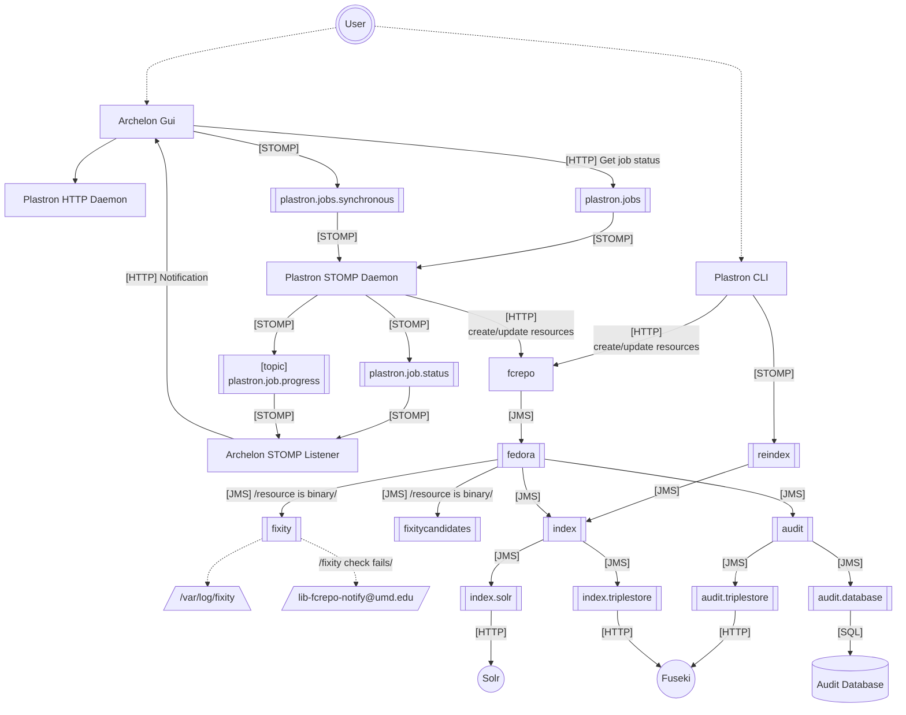

# Mermaid Demo

## Introduction

Demonstration of "Mermaid" diagramming tool - <https://mermaid.js.org/>

## Example Embedded Mermaid Diagram

Mermaid diagrams can be embedded directly into Markdown, and rendered
automatically by GitHub.

The following diagram attempts to replicate
<https://github.com/umd-lib/umd-fcrepo/blob/main/docs/img/MessagingSystem.svg>
using Mermaid.

